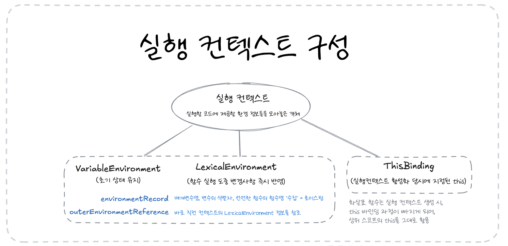

## 1. 실행 컨텍스트(Execution Context)란?



- 실행 컨텍스트는 실행할 코드에 제공할 환경 정보들을 모아놓은 객체

- JavaScript 엔진은 실행 컨텍스트가 활성화되는 시점에 다음과 같은 중요한 동작들을 수행

  - 선언된 변수를 위로 끌어올림 (호이스팅)
  - 외부 환경 정보 구성
  - this 값 설정

- 실행 컨텍스트는 코드 실행을 위한 환경과 순서를 보장하기 위해 다음과 같이 작동

  1. 동일 환경의 코드들을 실행하는 데 필요한 환경 정보들로 컨텍스트를 구성
  2. 이를 콜 스택(Call Stack)에 쌓음
  3. 스택의 최상위 컨텍스트와 관련된 코드를 실행

```javascript
// 콜 스택 최대 용량 초과 예시
var eternalLoop = function () {
  return eternalLoop();
};
// 결과: Uncaught RangeError: Maximum call stack size exceeded
```

### 실행 컨텍스트의 구성 요소

실행 컨텍스트는 세 가지 주요 환경 정보를 포함!

1. **VariableEnvironment**:

   - 현재 컨텍스트 내의 식별자 정보
   - 외부 환경 정보
   - 선언 시점의 스냅샷으로 변경사항이 반영되지 않음

2. **LexicalEnvironment**:

   - 초기에는 VariableEnvironment와 동일
   - 변경사항이 실시간으로 반영됨
   - environmentRecord와 outerEnvironmentReference로 구성

3. **ThisBinding**:
   - this 식별자가 참조하는 대상 객체

## 2. 호이스팅(Hoisting)

호이스팅은 "JavaScript 엔진이 식별자들을 최상단으로 끌어올려놓은 다음 실제 코드를 실행한다"는 개념

```javascript
function a(x) {
  console.log(x); // 1
  var x;
  console.log(x); // 1
  var x = 2;
  console.log(x); // 2
}
a(1);
```

위 코드는 호이스팅에 의해 실제로 다음과 같이 동작

```javascript
function a(x) {
  var x; // 호이스팅된 변수 선언
  var x;
  var x;

  x = 1; // 매개변수 할당
  console.log(x);
  console.log(x);
  x = 2; // 새로운 값 할당
  console.log(x);
}
```

### 함수 선언문과 표현식의 차이

함수를 정의하는 두 가지 방식이 있으며, 호이스팅 동작이 다르다.

```javascript
// 함수 선언문 - 전체가 호이스팅됨
function a() {}
a(); // 정상 동작

// 함수 표현식 - 변수 선언부만 호이스팅됨
var b = function () {};
b(); // 정상 동작

// 기명 함수 표현식
var c = function d() {};
c(); // 정상 동작
d(); // Error: d is not defined
```

## 3. 스코프와 스코프 체인

스코프는 식별자의 유효범위를 의미하며, ES5까지는 전역 공간을 제외하면 오직 함수만이 스코프를 생성

스코프 체인은 식별자를 찾을 때 안쪽에서 바깥으로 차례대로 검색해나가는 것을 의미하며, 이는 LexicalEnvironment의 outerEnvironmentReference를 통해 구현

```javascript
var a = 1;
var outer = function () {
  var inner = function () {
    console.log(a); // undefined
    var a = 3;
  };
  inner();
  console.log(a); // 1
};
outer();
console.log(a); // 1
```

## 4. this

실행 컨텍스트를 활성화하는 당시에 지정된 this가 저장
함수를 호출하는 방법에 따라 그 값이 달라지며, 지정되지 않은 경우에는 전역 객체가 저장
